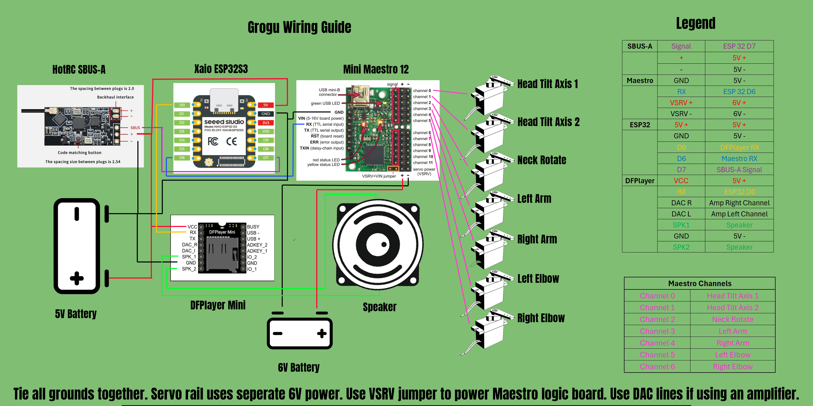

# Wiring Reference

## Default Pin Assignments

| Firmware constant | XIAO pin | ESP32-S3 GPIO | Direction | Connects to |
| --- | --- | --- | --- | --- |
| `SBUS_RX_PIN` | `D7` | `GPIO44` | Input to XIAO | HOTRC SBUS-A receiver SBUS output |
| `MAESTRO_TX_PIN` | `D6` | `GPIO43` | Output from XIAO | Pololu Maestro `RX` |
| `DFPLAYER_TX_PIN` | `D0` | `GPIO1` | Output from XIAO | DFPlayer Mini `RX` through about `1k` series resistance |

The Seeed XIAO ESP32-S3 pin table lists `D6` as UART TX on `GPIO43` and `D7`
as UART RX on `GPIO44`.

## Connections

| From | To | Notes |
| --- | --- | --- |
| External regulated 6V source positive | Maestro servo power rail positive | Dedicated servo power input. Size this supply for the servo stall current. |
| Maestro VSRV/VIN jumper | Installed | Lets the Maestro servo rail power Maestro logic/VIN. Confirm this matches your Maestro model's documentation. |
| External regulated 5V source positive | XIAO `5V` pin | Powers the ESP32 when not connected to USB. This should come directly from the external regulated 5V source. |
| External regulated 5V source positive | HOTRC SBUS-A receiver VCC | Powers the receiver. Confirm the receiver accepts 5V. |
| HOTRC SBUS-A receiver SBUS signal | XIAO `D7` / `GPIO44` | SBUS input. Firmware uses inverted UART mode by default. |
| HOTRC SBUS-A receiver GND | Common GND | Must be shared with XIAO, Maestro, and servo supply. |
| XIAO `D6` / `GPIO43` | Maestro `RX` | Compact serial commands to the Maestro. |
| XIAO `D0` / `GPIO1` | DFPlayer Mini `RX` | Use about `1k` in series on the DFPlayer RX line. |
| XIAO GND | Maestro GND | Required serial reference. |
| XIAO GND / common GND | DFPlayer Mini `GND` | Required serial and power reference. |
| External regulated 5V source positive | DFPlayer Mini `VCC` | Use regulated 5V with enough current for audio playback. |
| Speaker | DFPlayer Mini `SPK1` / `SPK2` | Speaker connects to the DFPlayer output, not the ESP32. |
| External regulated 6V source GND | Maestro servo power rail ground | Dedicated servo supply ground. |
| Maestro GND / servo rail ground | Common GND | Tie to XIAO, receiver, and all servo grounds. |

## Maestro Servo Outputs

| Maestro channel | Function |
| --- | --- |
| `CH0` | Head tilt axis 1 |
| `CH1` | Head tilt axis 2 |
| `CH2` | Neck rotate |
| `CH3` | Left arm |
| `CH4` | Right arm |
| `CH5` | Left elbow |
| `CH6` | Right elbow |

## Electrical Notes

- Do not power servos from the XIAO ESP32-S3.
- Keep all grounds common.
- The intended wiring uses a regulated 5V source for the receiver, XIAO, and
  DFPlayer, plus a separate regulated 6V source for the Maestro servo rail.
- The Maestro VSRV/VIN jumper powers Maestro logic from the servo rail.
- Do not feed raw 2S LiPo voltage into the XIAO.
- A small USB-style supply is usually not enough for multiple servos.
- ESP32-S3 GPIO is 3.3V logic. If the receiver SBUS output is 5V logic, use a
  level shifter or voltage divider before `GPIO44`.
- Configure the Maestro serial settings for `9600` baud, UART serial, compact
  protocol-compatible operation, and CRC off.
- To change UART pins, edit `SBUS_RX_PIN`, `MAESTRO_TX_PIN`,
  and `DFPLAYER_TX_PIN` at the top of the private firmware repo's
  `src/main.cpp`.
